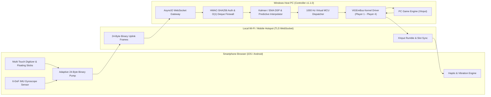
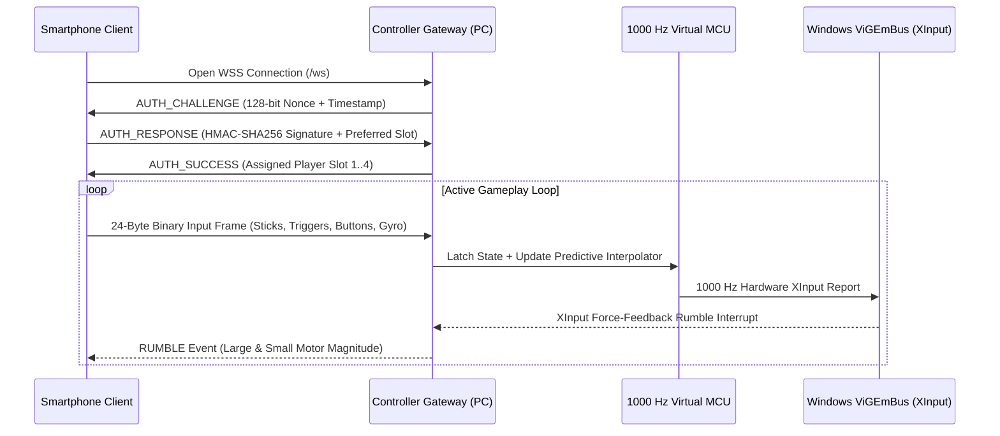
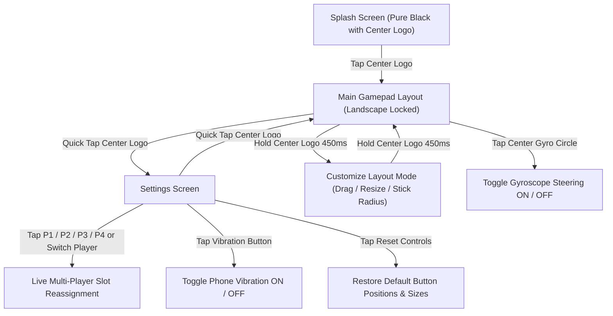

# Controller v1.1.0

**Controller** is a free, open-source software project that turns any smartphone into a low-latency wireless Xbox 360 gamepad for Windows PC games.

Built for players who want to play controller-supported PC games—such as racing simulators, sports games, platformers, fighting games, and local 4-player couch co-op titles—using the phone already in their pocket, **Controller** requires no mobile app store downloads, no cables, and no subscriptions. Simply launch the server on your PC, scan the QR code with your phone camera, and play.

---

## Key Features

- **100% Free and Open Source**: Released under the MIT License with zero ads, zero tracking, and zero paywalls.
- **Native Xbox 360 Kernel Emulation**: Uses the industry-standard ViGEmBus driver to register up to 4 authentic virtual Xbox 360 controllers (`XInput`) directly in Windows Device Manager. Compatible with Steam, Epic Games, Xbox Game Pass, and standalone PC titles.
- **No Mobile App Installation Required**: The controller interface runs instantly in any modern mobile browser (Safari on iOS, Chrome on Android) over your local Wi-Fi or Windows Mobile Hotspot.
- **Up to 4 Simultaneous Players**: Connect up to 4 phones at once for local multiplayer. Switch or swap player slots (`P1`–`P4`) live from either the phone Settings screen or the PC dashboard.
- **Sub-5ms Local Loopback & Anti-Bufferbloat Engine**: Powered by a 24-byte zero-copy binary wire protocol (`BINARY v2`), adaptive transmission pacing, and a 1000 Hz Virtual MCU hardware dispatch thread.
- **6-DoF Gyroscope Motion Steering**: Optional tilt steering with discrete Kalman and EMA signal filtering, adjustable deadband, and an on-screen horizon indicator (default off; toggle on anytime by tapping the center gyroscope circle).
- **Bi-Directional Force-Feedback Vibration**: Relays native XInput dual-motor rumble events from PC games back to your phone (default off; toggleable in Settings).
- **Full On-Screen Layout Customization**: Hold the center logo for 450ms to drag, resize, and adjust joystick radii for every control on the screen, or reset to factory defaults with one tap.
- **Dual Runtime Editions**:
  - `Controller.exe` (**GUI Edition**): Monochromatic desktop telemetry dashboard with QR pairing, 1-click driver installer, live slot swapping, and per-player oscilloscopes.
  - `Controller-Terminal.exe` (**Terminal Edition**): Zero-GUI console server for maximum competitive performance and minimal system overhead.

---

## System Architecture



---

## Connection and Low-Latency Streaming Pipeline



---

## Mobile Controls and Navigation Workflow



---

## Quick Start Guide

### Option 1: Standalone Windows Executables (`v1.1.0`)

1. **Launch Controller**:
   - Run `dist\Controller.exe` for the full desktop GUI dashboard, or
   - Run `dist\Controller-Terminal.exe` for the zero-GUI terminal server.
2. **Install the Virtual Xbox Driver (One-Time Setup)**:
   - If the ViGEmBus driver is not yet installed on your PC, click **INSTALL DRIVER** in the top bar of the GUI (or run `scripts\install_driver.bat` as Administrator). No reboot is required.
3. **Connect Your Phone**:
   - Connect your phone and PC to the same Wi-Fi network (or turn on **Windows Mobile Hotspot** on your PC and connect your phone directly to the PC for the lowest possible ping).
   - Scan the QR code shown on the PC screen using your phone camera, or open `https://<YOUR_PC_IP>:8443` in your mobile browser.
   - If your browser shows a local self-signed SSL warning on first visit, tap **Advanced** -> **Proceed**.
4. **Play**:
   - Tap the center logo on the splash screen to enter fullscreen landscape mode and start playing your PC game.

---

### Option 2: Run from Source (Python 3.10+)

```powershell
# 1. Install dependencies
pip install -r requirements.txt

# 2. Launch the Desktop GUI Edition (Controller v1.1.0)
python main.py

# Or launch the Zero-GUI Terminal Edition (Controller v1.1.0)
python terminal_main.py
```

#### Command-Line Flags (`Controller.exe` & `Controller-Terminal.exe`)

| Flag | Description |
| :--- | :--- |
| `-v`, `--version` | Display version (`Controller v1.1.0`) and exit |
| `-h`, `--help` | Display command-line help and interactive shortcuts |
| `--headless`, `--no-gui` | Run `Controller.exe` in headless terminal mode |
| `--port <int>` | Specify a custom WebSocket/HTTPS port (default: `8443`) |
| `--no-ssl` | Run over plain HTTP/WS instead of HTTPS/WSS |

#### Interactive Terminal Shortcuts (`Controller-Terminal.exe`)

| Command | Action |
| :--- | :--- |
| `s` or `swap` | Swap Player 1 and Player 2 controller slots |
| `t` or `test [sec]` | Trigger a test vibration pulse on Player 1 |
| `stop` | Immediately stop active vibration on Player 1 |
| `p` or `pulse` | Pulse Button A on Player 1 to wake up browser gamepad testers |
| `status` | Display connected phones and player slot assignments |
| `q` or `quit` | Gracefully shut down the server |

---

## Performance Architecture (`v1.1.0`)

**Controller v1.1.0** is engineered to eliminate wireless bufferbloat, Python GIL contention, and Wi-Fi burst jitter:

1. **24-Byte Zero-Copy Binary Wire Protocol (`BINARY v2`)**:
   Packs sequence number, timestamp, 4 signed 16-bit thumbstick axes (`LX`, `LY`, `RX`, `RY`), 2 unsigned 8-bit triggers (`LT`, `RT`), a 16-bit button bitmask, 16-bit gyroscope angle, flags, and RTT telemetry into a fixed 24-byte frame—reducing payload size by over 88% compared to JSON.
2. **Client Anti-Bufferbloat & Adaptive Pacing**:
   Streams inputs at up to 400 Hz (`2.5ms` interval) when sticks, triggers, buttons, or gyroscope are actively moving, and automatically throttles neutral keepalive packets to 40 Hz (`25ms` interval) when untouched. Non-critical frames are gated at `bufferedAmount <= 256` bytes so stale packets never queue in the phone's Wi-Fi transmit buffer.
3. **Wi-Fi A-MPDU Burst Coalescing & O(1) Firewall**:
   Coalesces consecutive back-to-back binary frames with identical button bitmasks when Wi-Fi A-MPDU aggregation delivers a packet burst, while preserving every button press and release transition in exact sequence.
4. **GIL-Cooperative 1000 Hz Virtual MCU Thread**:
   Uses 0.5ms Windows kernel timer resolution (`NtSetTimerResolution`) and cooperative GIL yields (`0.5ms` Python thread switch interval) to feed active ViGEmBus controllers at 1000 Hz while skipping idle hardware slots.

### Benchmark Summary (Multi-Client TLS + 1000 Hz MCU + 60 FPS GUI + Wi-Fi Bursts)

| Metric | v1.1.0 Measured Result |
| :--- | :--- |
| **Localhost TLS Median (P50) RTT** | `4.37 ms` |
| **Localhost TLS Mean RTT** | `4.52 ms` |
| **Localhost TLS P95 RTT** | `6.41 ms` |
| **Localhost TLS P99 RTT** | `10.03 ms` |
| **Max RTT Spike under Wi-Fi Burst** | `11.70 ms` |
| **Spikes > 30 ms** | `0` |
| **Unexpected Disconnects** | `0` |

---

## Repository Structure

| Path | Description |
| :--- | :--- |
| `main.py` | Entrypoint for `Controller.exe` (Desktop GUI Edition `v1.1.0`) |
| `terminal_main.py` | Entrypoint for `Controller-Terminal.exe` (Zero-GUI Terminal Edition `v1.1.0`) |
| `config/settings.py` | Global application version (`1.1.0`), network ports, DSP filter constants, and security parameters |
| `gateway/server.py` | AsyncIO HTTPS/WSS server, burst coalescer, slot router, and static asset handler |
| `gateway/input_manager.py` | 4-player ViGEmBus Xbox 360 controller manager and `SendInput` keyboard fallback |
| `gateway/mcu_dispatch.py` | 1000 Hz Virtual MCU hardware dispatch engine with predictive micro-interpolation |
| `gateway/predictive_interpolator.py` | Per-axis dead-reckoning and smooth micro-interpolation engine |
| `gateway/kernel_transport.py` | `TCP_NODELAY` socket tuner and 24-byte `BINARY v2` struct decoder |
| `gateway/filters.py` | Discrete 2-state Kalman filter, EMA low-pass filter, deadband, and steering curves |
| `gateway/security.py` | HMAC-SHA256 challenge-response authenticator and `O(1)` deque anomaly firewall |
| `gui/dashboard.py` | Monochromatic 60 FPS CustomTkinter telemetry dashboard and 5-step setup wizard |
| `gui/state_bridge.py` | Thread-safe telemetry bridge between the AsyncIO gateway and GUI dashboard |
| `client/index.html` | Mobile web application layout and settings screen (`v1.1.0`) |
| `client/css/cockpit.css` | Pure monochromatic circular stylesheet |
| `client/js/cockpit.js` | Core mobile gamepad engine, adaptive binary pump, and dual tap/hold logo handler |
| `client/js/digitizer.js` | High-rate `pointerrawupdate` and coalesced touch digitizer |
| `client/js/gyro.js` | 6-DoF gyroscope sensor manager and horizon indicator |
| `client/js/haptics.js` | Mobile vibration and Web Audio tactile synthesis engine |
| `client/js/layout_customizer.js` | Interactive drag, resize, and stick radius customization engine |
| `tests/` | Automated unit, stress, security, and end-to-end integration test suite (80 tests) |

---

## Verification and Building

### Run Automated Test Suite

```powershell
python -m pytest tests/ -v
```

### Build Standalone Windows Executables (`Controller.exe` & `Controller-Terminal.exe`)

```powershell
pyinstaller --clean -y Controller.spec
```

---

## License

Released under the **MIT License**. Free and open source for everyone.
